# 🛒 E-Commerce Bazaar 


E-Commerce Bazaar is a fully responsive online shopping web application developed using **React.js**. It provides a seamless shopping experience with features such as product browsing, category-based filtering, detailed product pages, shopping cart management, and user authentication. The project uses **JSON Server** as a mock backend and provides a clean, responsive interface optimized for desktop and mobile devices.

---

## 📑 Table of Contents

- [🎥 Project Demo](#-project-demo)
- [🛠️ Technologies Used](#️-technologies-used)
- [🚀 Features](#-features)
- [⚙️ Setup Instructions](#️-setup-instructions)
- [📸 Screenshots](#-screenshots)
- [👨‍💻 Author](#-author)
- [📄 License](#-license)

---

## 🎥 Project Demo

Click the image below to watch the complete demo video.

[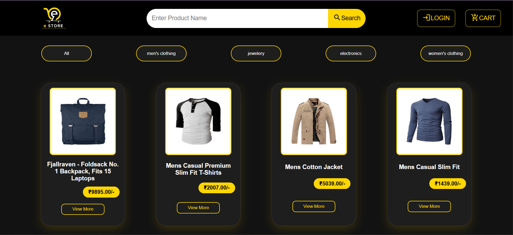](demo/ecommerce-demo.mp4)

---

## 🛠️ Technologies Used

- React.js
- React Router DOM
- Axios
- JSON Server
- React Toastify
- Material UI Icons
- React Icons
- HTML5
- CSS3
- JavaScript (ES6)

---
## 🚀 Features

- Browse all products
- Filter products by category
- View detailed product information
- Add products to cart
- Remove products from cart
- User Registration
- User Login
- Shopping Cart Management
- Responsive Design (Desktop & Mobile)
- Toast Notifications

---

## ⚙️ Setup Instructions

### Prerequisites

- Node.js (v18 or later)
- npm

### Install Dependencies

```bash
npm install
```

### Start the React Application

```bash
npm run dev
```

### Start JSON Server

```bash
npx json-server --watch src/jsondata/appdata.json --port 4000
```

### API Base URL

```
http://localhost:4000
```

### Available Endpoints

```
/products
/users
/cartitems
```
---

## 📸 Screenshots

The following screenshots showcase the application's desktop and mobile responsive interfaces.

### 🏠 Home Page

#### Desktop View


#### Mobile View

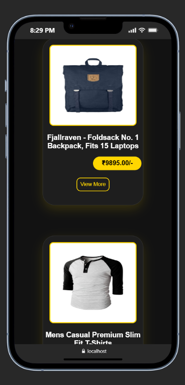

---

### 📄 Product Details

#### Desktop View

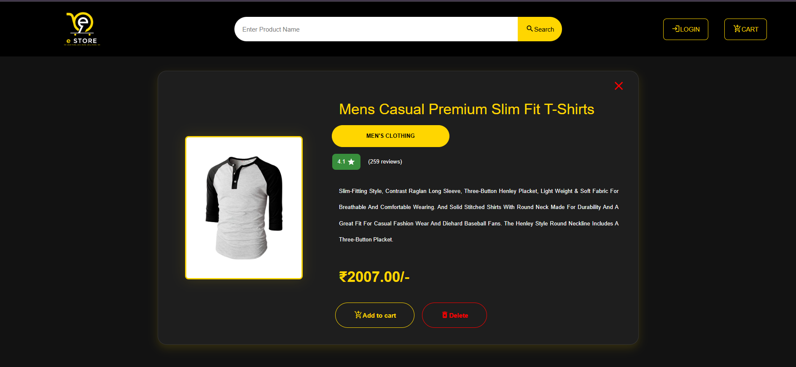

#### Mobile View 1

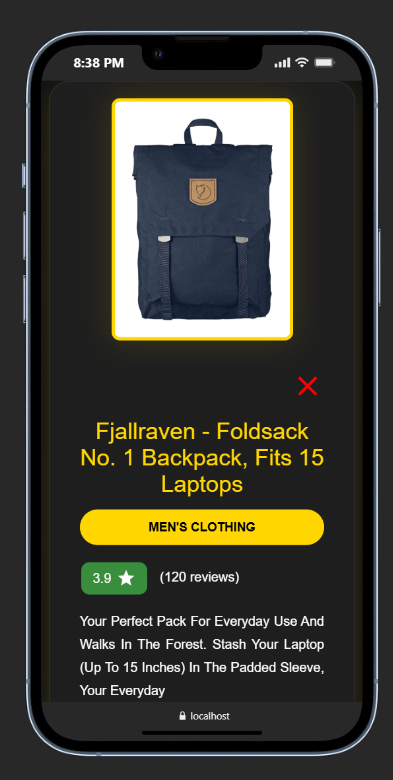

#### Mobile View 2

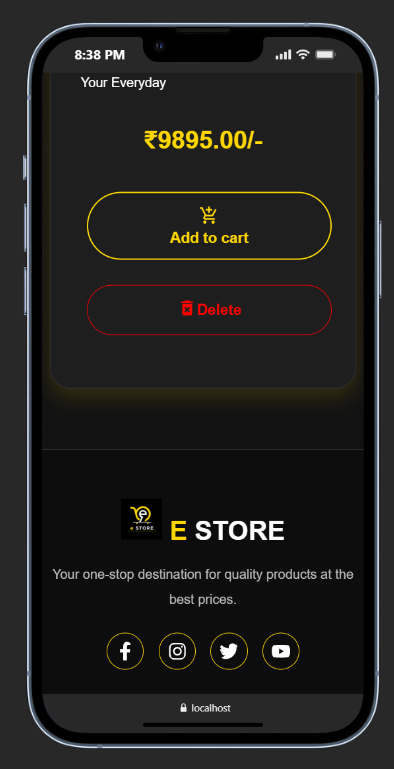

---

### 🛒 Shopping Cart

#### Desktop View 1

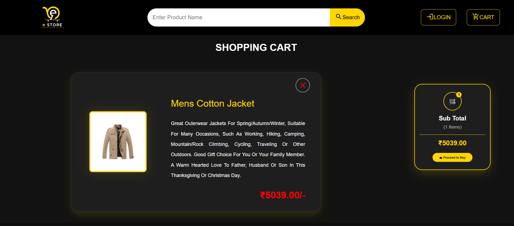

#### Desktop View 2

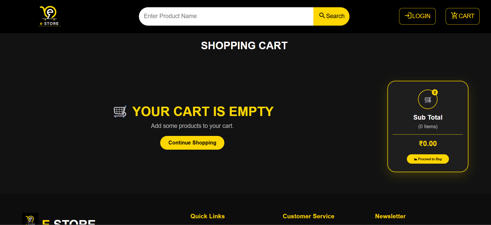

#### Mobile View 1

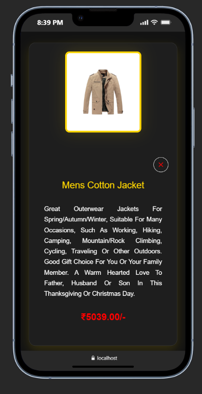

#### Mobile View 2

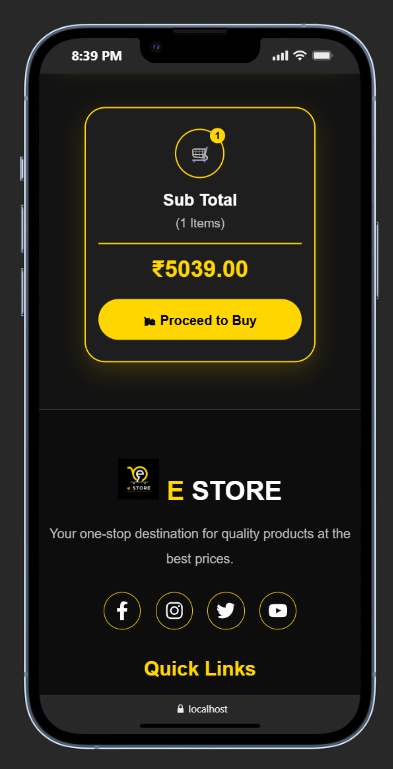

#### Mobile View 3

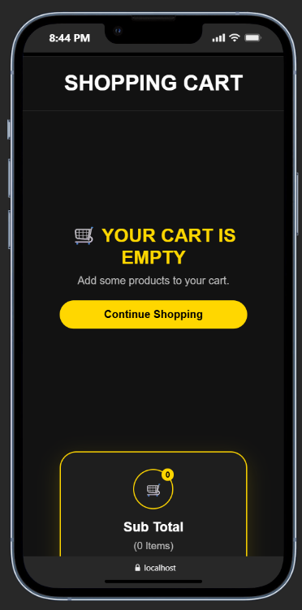

---

### 🔐 Login

#### Desktop View

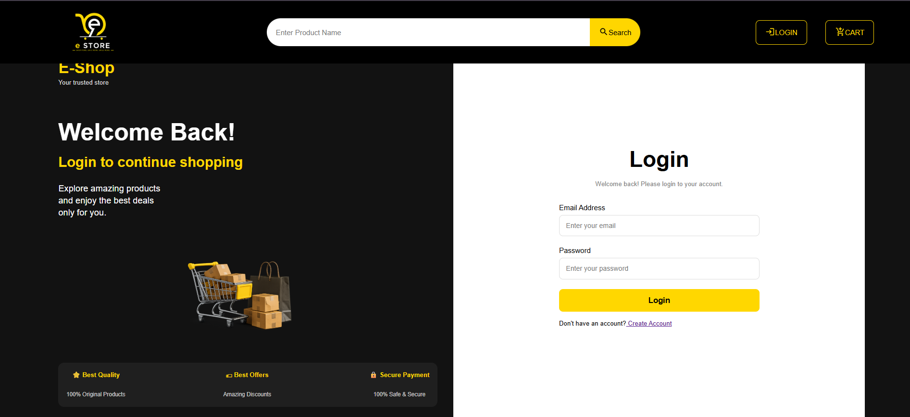

#### Mobile View 1

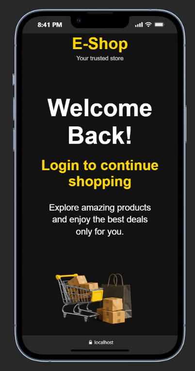

#### Mobile View 2

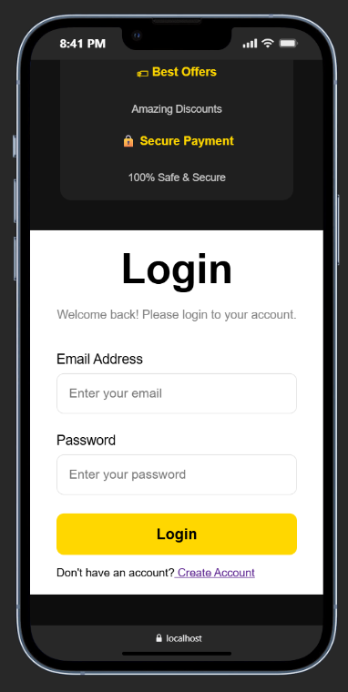

---

### 👤 Register

#### Desktop View

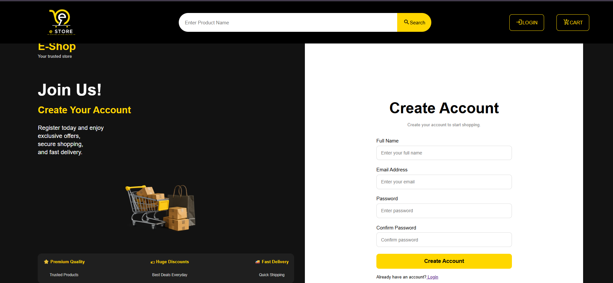

#### Mobile View 1

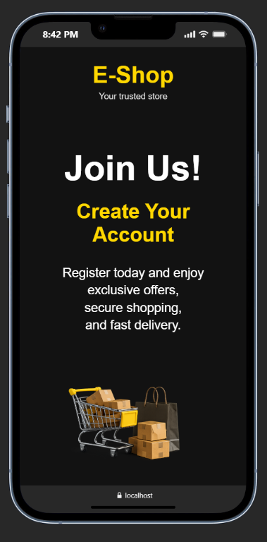

#### Mobile View 2

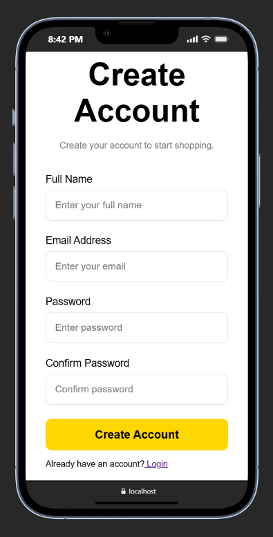

---

### 📄 Footer

#### Desktop View

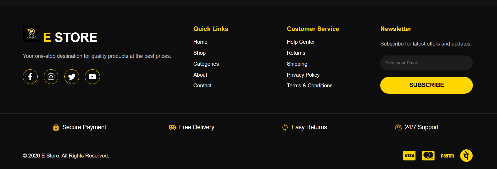

#### Mobile View 1

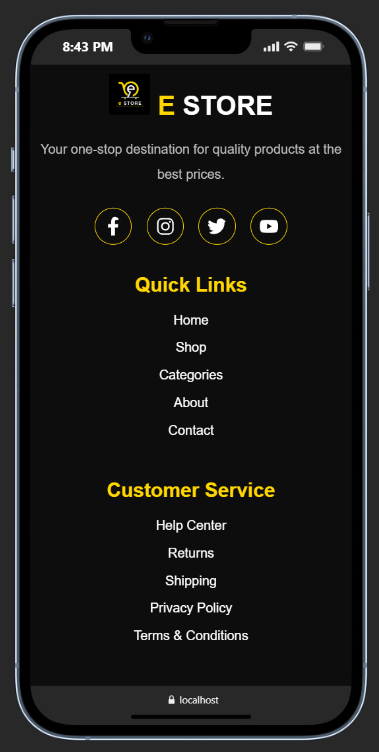

#### Mobile View 2

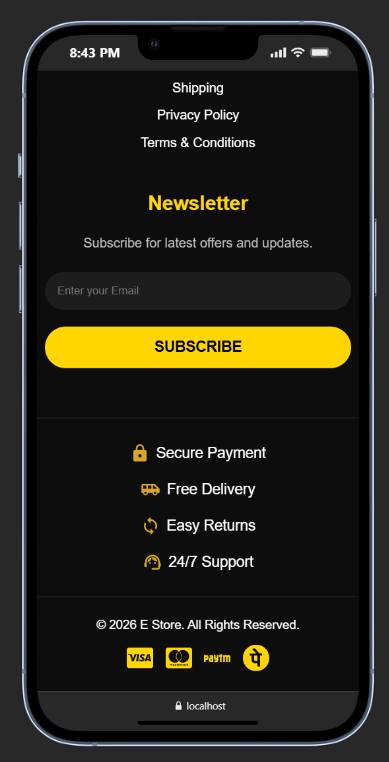


---

## 👨‍💻 Author

**Sachin K**

🌐 **Portfolio:** <https://ksachin.netlify.app>

💻 **GitHub:** <https://github.com/Sachin-K-0672>

💼 **LinkedIn:** <https://www.linkedin.com/in/sachin-k-3865a8380/>

---

## 📄 License

This project was developed for learning purposes and to showcase React.js development skills in a personal portfolio.


